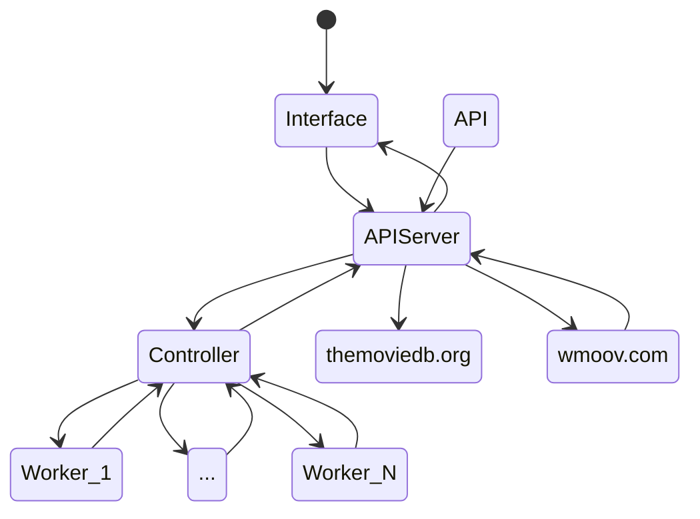
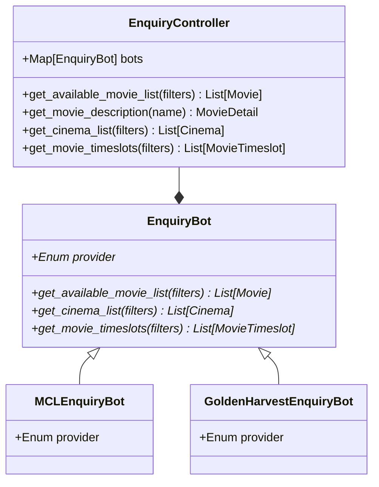

# movie-ticket-search-engine

<!-- ABOUT THE PROJECT -->

## About The Project

This is a search engine for Hong Kong movie tickets. It allows user to provide fields to search through Hong Kong cinemas to find the available time slots, so that they could choose from a filtered list of available time slot and find the best and suitable price for a movie.

### Built With

#### Website

- React JS
- REST

#### API Gateway

- REST
- GRPC
- Express
- NodeJS

#### Control Plane & Workers

- GRPC
- Python

<!-- GETTING STARTED -->

## Getting Started

Install Docker and Docker Compose:
Download Docker Desktop for your operating system from the [official Docker website](https://www.docker.com/products/docker-desktop/). Docker Compose is typically included with Docker Desktop installation.

Build the Docker images:
Run the following command to build the Docker images defined in the docker-compose.yml file:

```sh
> docker-compose build
```

Run the following command to start the containers defined in the docker-compose.yml file:

```sh
> docker-compose up
```

This will start all the services and containers defined in the YAML file, and you should see logs from each container being printed to the terminal. By default, the containers run in the foreground. If you want to run them in the background, you can use the -d flag:

```sh
> docker-compose up -d
```

Access the services:
Once the containers are up and running, you can access the WEB UI with localhost:3000

Stop the containers:
To stop the containers, use the following command:

```sh
> docker-compose down
```

## Description

This architecture consists of an web UI interface that communicates with an API server. The API server is responsible for handling requests from the interface, and it communicates with three external services: themoviedb.org, wmoov.com, and a group of worker nodes.

themoviedb.org is used to retrieve detailed information about a movie, while wmoov.com is used to obtain information about all movies currently showing in Hong Kong. The worker nodes are responsible for retrieving detailed information about the timeslots of movies at different cinemas.

The controller node manages the worker nodes and communicates with the API server to retrieve information about which movies and cinemas to retrieve timeslot information for. The worker nodes operate in parallel to retrieve the timeslot information, and the controller node aggregates and processes the results before returning them to the API server, which then returns the data to the interface.

This architecture is designed for parallel programming, as the worker nodes operate independently of each other and can retrieve information in parallel. This allows for efficient processing of large amounts of data and faster response times. The control plane only manages the group of worker nodes and does not participate in data retrieval or processing.

## Architecture



## Worker structure


