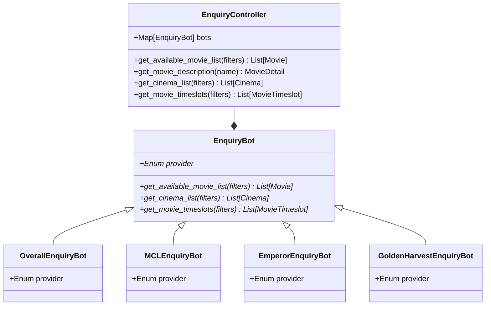

# movie-ticket-search-engine

<!-- ABOUT THE PROJECT -->

## About The Project

This is a search engine for Hong Kong movie tickets. It allows user to provide fields to search through Hong Kong cinemas to find the available time slots, so that they could choose from a filtered list of available time slot and find the best and suitable price for a movie.

### Built With

This section should list any major frameworks/libraries used to bootstrap your project. Leave any add-ons/plugins for the acknowledgements section. Here are a few examples.

<!-- GETTING STARTED -->

## Getting Started

## Architecture

## Worker structure

